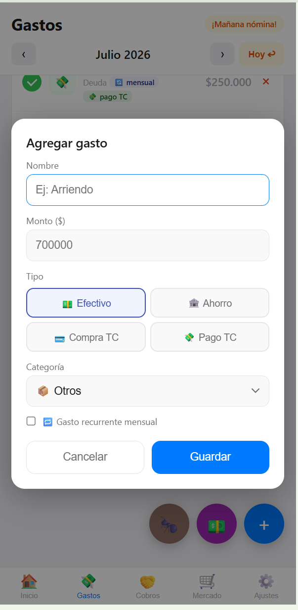
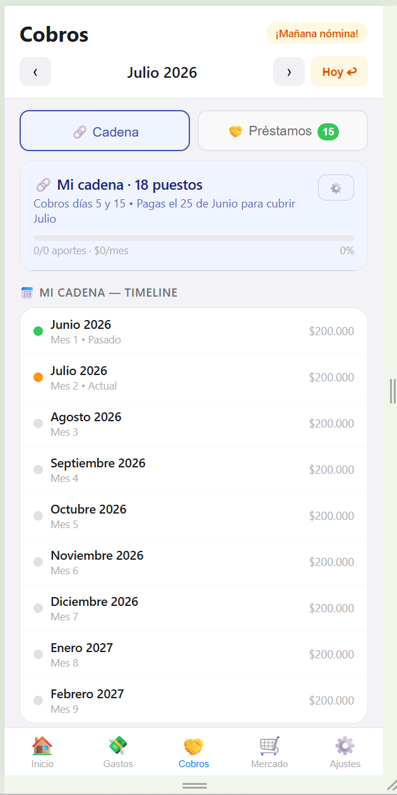
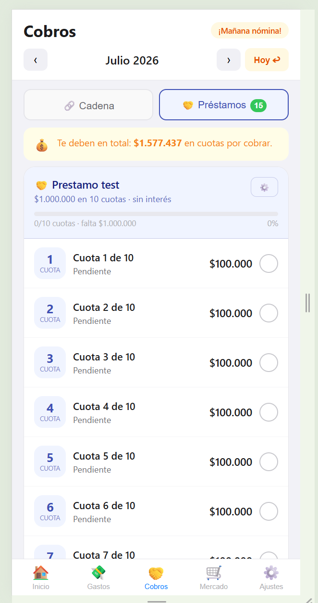
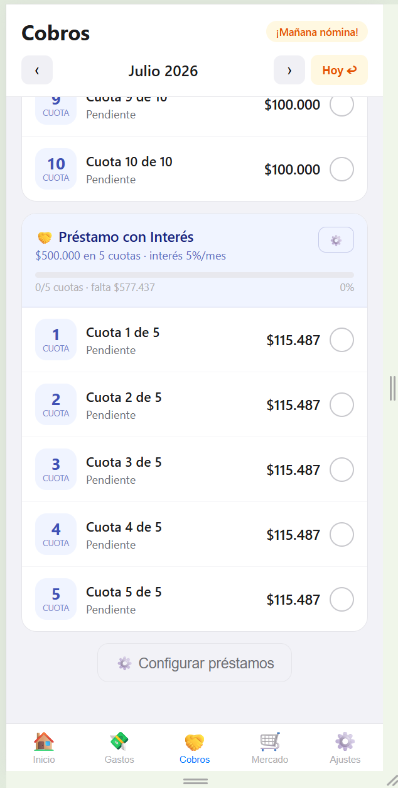
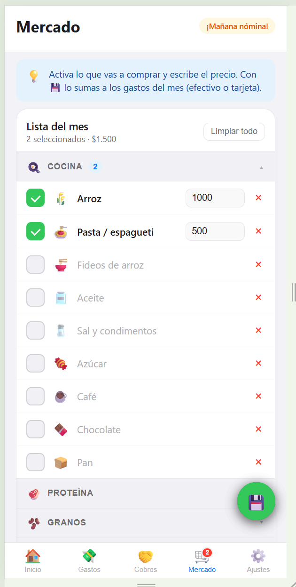
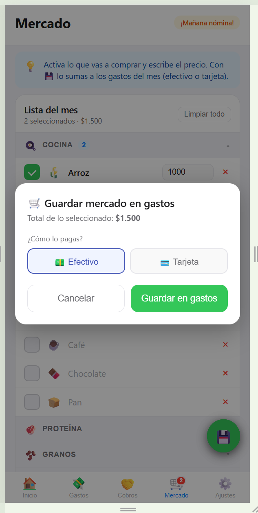
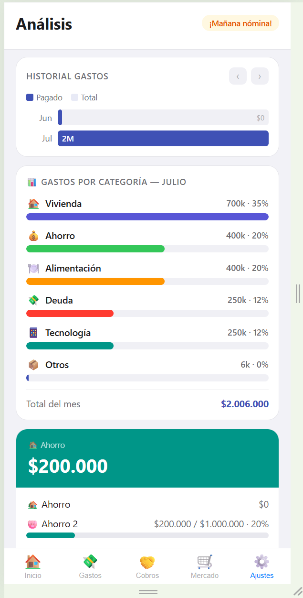
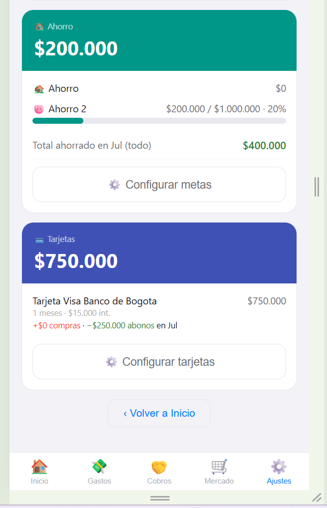
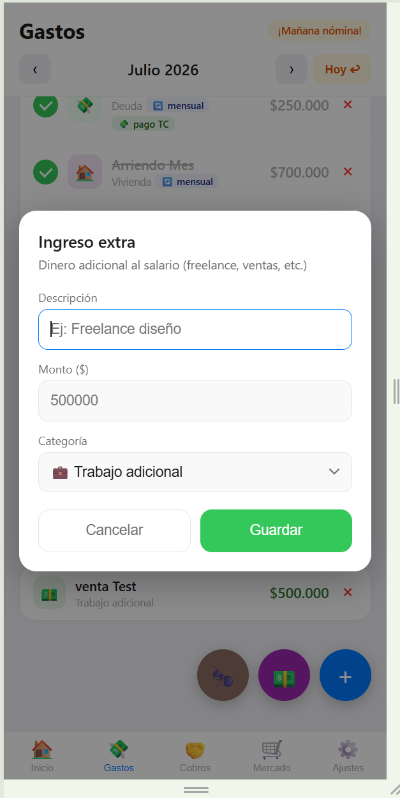
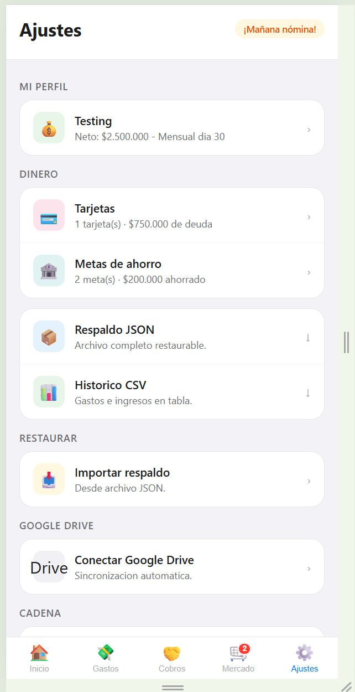

# 💰 Cartera

> Tus finanzas del mes, claras y en tu bolsillo. **Una sola pantalla te dice cuánta plata te queda libre.** Sin crear cuentas, sin servidores, sin publicidad. Tus datos viven en *tu* teléfono (y, si quieres, en *tu* Google Drive).


[](https://cartera-mes.pages.dev)

### 🔗 Pruébala ya → **[cartera-mes.pages.dev](https://cartera-mes.pages.dev)**

---

## ¿Qué es esto? (en simple)

**Cartera** es una app para llevar las cuentas del mes desde el celular. La idea es responder una sola pregunta importante:

> **"Después de pagar todo lo del mes, ¿cuánta plata me queda libre?"**

Lo abres, registras tus gastos fijos (arriendo, servicios, mercado…), tus ahorros y tus deudas, y la app te muestra en grande lo que te queda. Vas marcando lo que ya pagaste y ves el progreso del mes.

Está pensada para Colombia: maneja **quincenas y nómina**, la **prima** de junio y diciembre, las **cadenas de ahorro (san)**, el **FNA** y los **préstamos a la familia**.

**No necesitas registrarte ni dar datos a nadie.** Todo se guarda en el navegador de tu teléfono. Es gratis y funciona aunque te quedes sin internet.

---

## Tabla de contenidos

- [Las pantallas, una por una](#las-pantallas-una-por-una)
- [Capturas](#capturas)
- [Lo importante que debes saber](#lo-importante-que-debes-saber)
- [Instalarla en el iPhone](#instalarla-en-el-iphone-como-una-app)
- [Respaldar tus datos](#respaldar-tus-datos-no-los-pierdas)
- [Para quien quiera el detalle técnico](#-para-quien-quiera-el-detalle-técnico)

---

## Las pantallas, una por una

La app tiene 5 botones abajo: **Inicio · Gastos · Cobros · Mercado · Ajustes.**

### 🏠 Inicio
Tu foto del mes. El número grande es **lo que te queda libre**. También ves cuántos días faltan para la nómina, cuánto llevas pagado y avisos útiles ("mañana es nómina", "vas al día", "te queda X libre", recordatorio de deuda).

### 💸 Gastos
La lista de todo lo que pagas en el mes. Cada gasto se **chulea** cuando lo pagas. Aquí puedes:
- Marcar un gasto como **recurrente** 🔁 para que aparezca solo cada mes.
- Elegir cómo lo pagas: **efectivo**, **ahorro** (suma a una meta), **compra con tarjeta** (sube tu deuda) o **pago de tarjeta** (baja la deuda).
- Sumar **gastos hormiga** 🐜 (el tinto, el cigarrillo, el bus): pequeños gastos del día que se juntan en uno solo.
- Registrar **ingresos extra** 💵 (un freelance, una venta, la prima).

### 🤝 Cobros — *la plata que entra o que te deben*
Un módulo con **dos pestañas**:

- **🔗 Cadena** — tu cadena de ahorro (san). Marcas cada cuota quincenal o mensual, ves cuánto llevas y un **timeline** que te dice en qué mes te toca **cobrar el pozo**. Soporta tener **un puesto propio y uno compartido** a la vez (cada turno aparece con su monto).
- **🤝 Préstamos** — el dinero que **tú le prestas a la familia**. Configuras hasta **5 préstamos** (a quién, monto, en cuántas cuotas, y un interés mensual opcional). La app calcula la **cuota** y tú **chuleas cada pago** que te hacen. Cada cuota que recibes entra automáticamente como un **ingreso extra "Préstamos recibido"** del mes, y ves en todo momento cuánto te falta por cobrar.

### 🛒 Mercado
Tu lista de mercado por categorías (cocina, proteína, aseo…). Activas lo que vas a comprar, le pones precio, y al terminar la guardas como **un gasto del mes** (eliges si lo pagaste en efectivo o con tarjeta).

### ⚙️ Ajustes
Tu perfil (salario y día de pago), tus **tarjetas** y **metas de ahorro**, los respaldos (exportar / importar), la conexión con **Google Drive**, el **PIN** de bloqueo y el **modo oscuro**.

> El **Análisis** (historial de meses, gastos por categoría, metas y deuda) lo abres desde el botón **"Ver análisis completo"** en Inicio.

---

## Capturas

| Inicio | Gastos | Agregar gasto |
|:---:|:---:|:---:|
|  |  |  |

| Cobros · Cadena | Cobros · Préstamos | Préstamos con interés |
|:---:|:---:|:---:|
|  |  |  |

| Mercado | Guardar mercado | Análisis |
|:---:|:---:|:---:|
|  |  |  |

| Metas y tarjetas | Ingreso extra | Ajustes |
|:---:|:---:|:---:|
|  |  |  |

---

## Lo importante que debes saber

### 📅 El mes que ves es el mes que la plata *cubre*
La nómina que te pagan, por ejemplo, el 25, normalmente cubre el **mes siguiente**. Por eso la app registra los gastos bajo el mes que **cubren**, no el día en que los pagas. La cadena de ahorro funciona igual: la pagas el mes anterior al que cubre. Esto la app te lo explica desde el primer uso.

Puedes moverte entre meses con las flechas ‹ › (hasta 2 meses hacia adelante para planear) y volver al actual con **"Hoy ↩"**.

### 🔒 Tus datos son tuyos
Nada sale de tu teléfono a menos que tú conectes tu Google Drive. No hay servidor que guarde tu información. Puedes poner un **PIN** para que nadie más la abra (el PIN nunca viaja a la nube).

### 💵 Formato y moneda
Todo en pesos colombianos con separador de miles (`$1.000.000`) y la app está 100 % en español.

---

## Instalarla en el iPhone (como una app)

1. Abre **[cartera-mes.pages.dev](https://cartera-mes.pages.dev)** en **Safari**.
2. Toca el botón **Compartir** (el cuadro con la flecha hacia arriba).
3. **"Agregar a pantalla de inicio".**

Queda con su propio ícono y sin la barra del navegador, igual que una app de la tienda. (En Android funciona igual desde Chrome → "Agregar a pantalla de inicio".)

---

## Respaldar tus datos (no los pierdas)

Como todo vive en el navegador, si borras el caché de Safari o cambias de teléfono, los datos se van. Para evitarlo tienes tres opciones, todas en **Ajustes**:

- **Respaldo JSON** — descarga un archivo con todo. Guárdalo donde quieras y luego *Importar* para recuperarlo.
- **Histórico CSV** — una tabla de tus gastos e ingresos para abrir en Excel.
- **Google Drive (recomendado)** — conéctalo una vez y la app guarda un respaldo **automático** en *tu* Drive cada vez que cambias algo. Si cambias de teléfono, restauras desde ahí. (Configuración paso a paso más abajo, en la sección técnica.)

> 💡 La restauración **reemplaza** lo que tengas en el teléfono por el respaldo (no mezcla), así que tus datos nunca quedan a medias.

---

## 🛠️ Para quien quiera el detalle técnico

<details>
<summary><b>Arquitectura, modelo de datos, despliegue, Google Drive y tests</b> (clic para expandir)</summary>

### Características (resumen técnico)

- **Un solo archivo** `index.html`: HTML + CSS + JS vanilla, **cero dependencias de build**, cero npm.
- **Separación absoluta código/datos**: el código es 100 % genérico y nunca contiene datos personales; los datos viven en `localStorage` con prefijo `app_`.
- **Gastos** con tipo excluyente (efectivo / ahorro→meta / compra TC / pago TC), recurrentes, gastos hormiga e ingresos extra.
- **Convención de mes** = el mes que el dinero cubre (no el de pago).
- **Módulo Cobros**: cadenas de ahorro v2 (varias cadenas, varios puestos, splits configurables, mensual/quincenal, cobro del pozo) + **préstamos a familia** (hasta 5, cuota por amortización, interés mensual opcional, cada cuota pagada se registra como ingreso "Préstamos recibido").
- **Tarjetas múltiples** con interés mensual (%) y meses para liquidar por amortización; deuda derivada de compras y abonos.
- **Metas de ahorro múltiples** con icono, progreso y racha.
- **Análisis** histórico con gráfico, desglose por categoría y salario congelado por mes (el histórico no se distorsiona al subir el sueldo).
- **PIN** (hash local, excluido del respaldo) y **modo oscuro**.
- **Exportar/Importar** JSON + CSV y **Google Drive sync** opcional (scope `drive.file`).

### Modelo de datos (`localStorage`, prefijo `app_`)

```
app_cfg              → nombre, salario neto, tipo de nómina y día(s)
app_{YYYY}_{M}       → gastos del mes (+ snapshot del salario de ese mes). M es 0-indexado
app_inc_{YYYY}_{M}   → ingresos extra del mes (incl. categoría "Préstamos recibido")
app_cd_{YYYY}_{M}    → estado de pagos de cadena del mes (v2)
app_ccfg             → cadenas (v2: array con posiciones, splits, frecuencia)
app_prestamos        → préstamos a familia [{id,persona,capital,meses,interes,cuotas}]
app_mrc              → lista de mercado
app_tcs              → tarjetas múltiples [{id,nombre,base,cuota,tasa}] (tasa = % mensual)
app_metas            → metas de ahorro [{id,nombre,icono,total,meta}]
app_pin              → hash del PIN (excluido del respaldo)
app_drive_cid/fid    → Client ID OAuth y file ID del respaldo en Drive
```

> Claves *legacy* que se migran solas al esquema nuevo: `app_tc` (tarjeta única → `app_tcs`), `app_meta` (→ `app_metas`), `app_sav_*` y `app_prima_*` (ya no se escriben).

**Privacidad:** los datos viven solo en el navegador del usuario y, opcionalmente, en *su* Google Drive. El scope `drive.file` solo permite a la app tocar archivos que ella misma creó — nunca el resto del Drive. El JSON exportado es un objeto plano `{ clave: valorString }` con todas las claves `app_*` (el PIN se excluye a propósito); restaurar reemplaza de forma **atómica**.

### Despliegue

Hosting estático, sin pipeline de build:

1. `index.html` en la raíz del repo.
2. Cloudflare Pages: **Create application → Pages → Connect to Git →** selecciona el repo.
3. **Sin build**: Build command vacío, Output directory en la raíz → **Deploy**.

> Cada `git push` a `main` redespliega automáticamente (~30 s).

### Configurar Google Drive sync (opcional)

1. [console.cloud.google.com](https://console.cloud.google.com) con tu cuenta **personal** de Google.
2. Crea un proyecto → **APIs y servicios → Biblioteca →** habilita **Google Drive API**.
3. **Pantalla de consentimiento OAuth →** tipo **Externo →** agrega tu correo en *Usuarios de prueba*.
4. **Credenciales → Crear → ID de cliente OAuth → Aplicación web** → en *Orígenes de JavaScript autorizados* pon la URL exacta de la app (`https://cartera-mes.pages.dev`, **sin** barra final).
5. Copia el **Client ID** y pégalo en **Ajustes → Conectar Google Drive →** autoriza.

El access token dura ~1 hora; la app funciona 100 % local sin token (solo se pausa el respaldo automático). En *Ajustes* aparece "Renovar token" cuando expira.

### Troubleshooting

| Problema | Causa | Solución |
|----------|-------|----------|
| `Error 400: redirect_uri_mismatch` | URL no registrada o corriendo desde `file://` | Registra la URL exacta en *Orígenes de JavaScript autorizados* |
| `Error 403: org_internal` | Consentimiento en modo "Interno" (cuenta Workspace) | Crea el proyecto desde una cuenta personal con consentimiento "Externo" |
| `Error 403: access_denied` | Usuario fuera de la lista de prueba | Agrega el correo en *Usuarios de prueba* |
| Los datos desaparecieron | Caché de Safari borrado | Restaura desde Drive o JSON: *Ajustes → Importar respaldo* |
| Drive no sincroniza | Token expirado | *Ajustes →* toca la fila de Drive → re-autoriza |
| La app pide onboarding de nuevo | `localStorage` purgado | Importa el último respaldo |

### Tests

```bash
node test/smoke.mjs
```

Smoke test sin dependencias (Node 18+ y Chrome/Edge): verifica que el JS embebido compile y que el nombre del usuario se escape (anti-XSS). Sale con código 0 si pasa (apto para CI).

### Stack

- **HTML + CSS + JavaScript vanilla** — cero dependencias de build
- **Google Identity Services** (`accounts.google.com/gsi/client`) — solo para OAuth
- **Google Drive API v3** — REST directo con `fetch`

</details>

---

## Licencia

Uso personal. Si la adaptas para otros: los datos por defecto del onboarding están vacíos — cada usuario configura los suyos.
