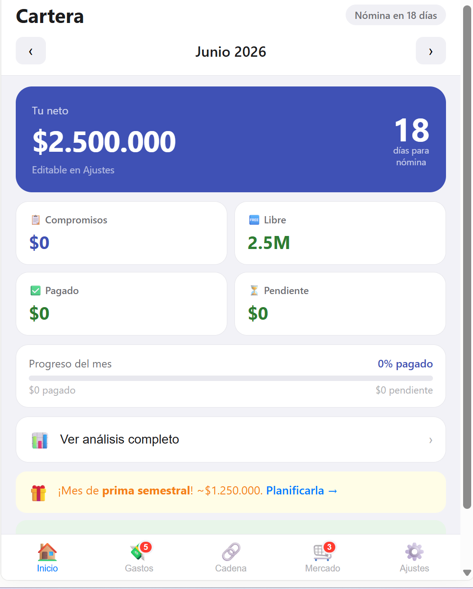
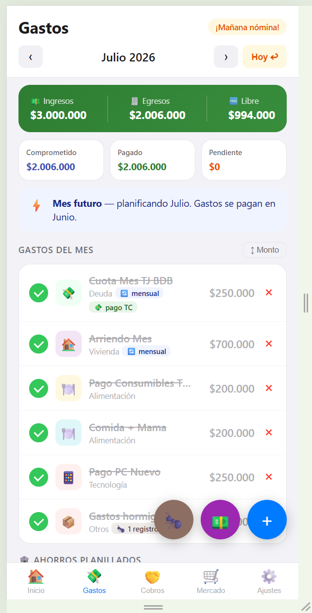
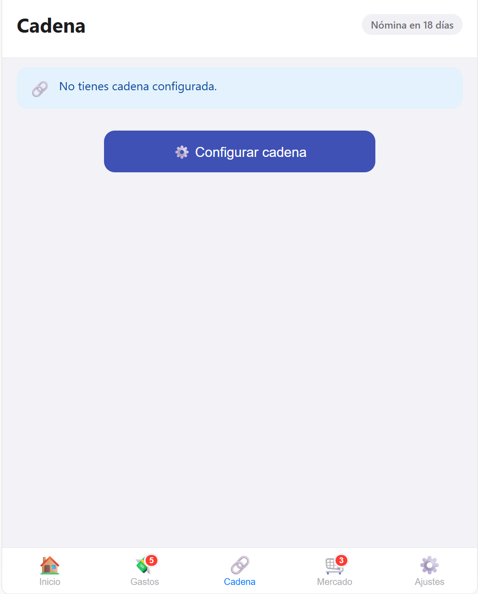
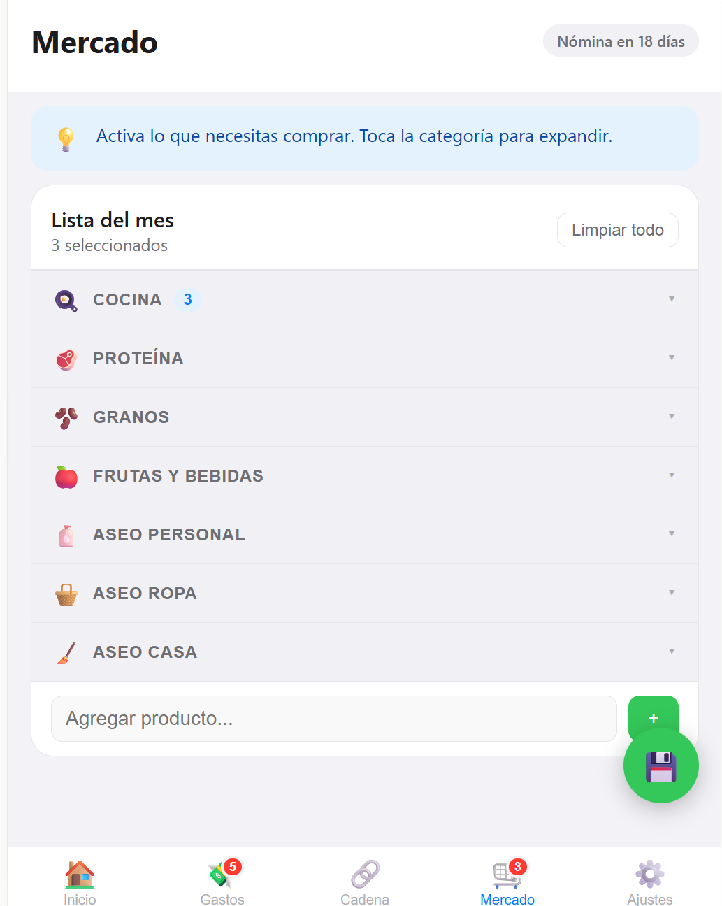
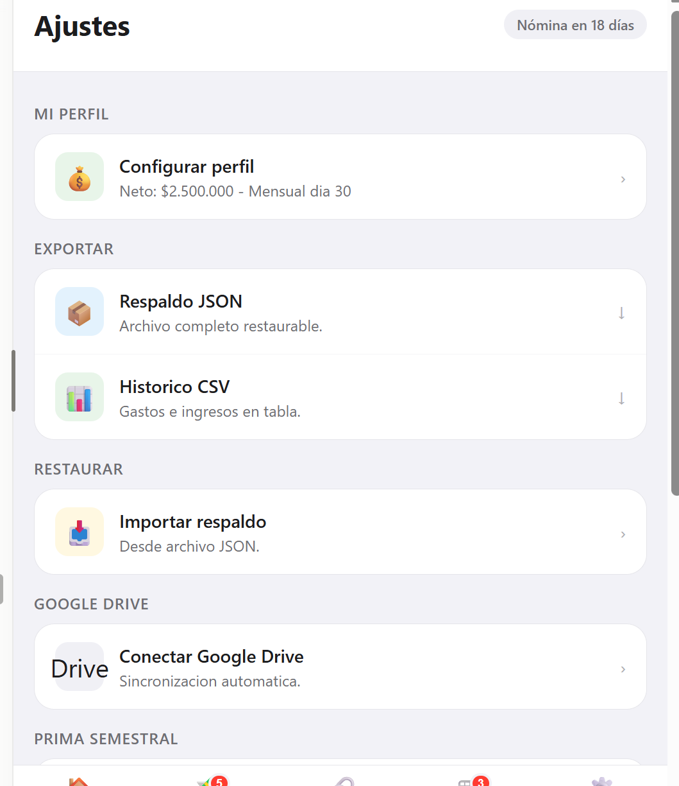

# 💰 Cartera

> Finanzas personales del mes, en **un solo archivo HTML**. Sin servidores, sin base de datos, sin frameworks, sin cuentas. Tus datos viven en tu navegador y, si quieres, en *tu* Google Drive.


[](https://cartera-mes.netlify.app)

### 🔗 En vivo → **[cartera-mes.netlify.app](https://cartera-mes.netlify.app)**

Aplicación web progresiva (PWA) de **cartera mensual personal**, pensada para usarse desde el iPhone. Pensada para el contexto financiero colombiano: prima semestral, cadenas de ahorro, FNA, quincenas y nómina.

---

## Tabla de contenidos

- [Características](#características)
- [Capturas](#capturas)
- [Cómo se usa](#cómo-se-usa)
- [Arquitectura](#arquitectura)
- [Despliegue](#despliegue)
- [Google Drive sync (opcional)](#configurar-google-drive-sync-opcional)
- [Instalación como app en iOS](#instalación-como-app-en-ios)
- [Troubleshooting](#troubleshooting)
- [Modelo de datos del respaldo](#modelo-de-datos-del-respaldo)
- [Stack](#stack)
- [Licencia](#licencia)

---

## Características

- **Gastos mensuales** con checklist de pagado/pendiente, montos editables e iconos por categoría
- **Ahorros planillados** separados de los gastos (FNA, cadenas de ahorro)
- **Cadena de ahorro** configurable: puestos, fechas quincenales, turnos de cobro y timeline completo
- **Lista de mercado** por categorías colapsables, con registro del gasto total al terminar
- **Prima semestral** (junio/diciembre, norma laboral colombiana) con asistente de distribución
- **Tracker de deuda** (tarjeta de crédito) con proyección de meses para liquidar
- **Meta de ahorro** con barra de progreso y abonos extra
- **Historial mensual** con gráfico comparativo y **desglose por categorías**
- **Modo oscuro** (tema iOS) con un toque en Ajustes
- **Días para la nómina** visibles en el header de todas las pantallas
- **Exportar**: respaldo JSON completo + histórico CSV para Excel
- **Importar**: restauración total desde JSON
- **Google Drive sync** (opcional): respaldo automático en cada cambio + **restauración** desde la nube

---

## Capturas

| Inicio | Gastos | Cadena de ahorro |
|:---:|:---:|:---:|
|  |  |  |

| Mercado | Ajustes |
|:---:|:---:|
|  |  |

---

## Cómo se usa

1. **Primer arranque** → un onboarding pide los datos básicos (salario neto, día de nómina). Nada viene precargado: la app es genérica y cada quien configura lo suyo.
2. **Pantalla Inicio** → resumen del mes: neto, días para nómina, totales de gastos/ahorros y metas.
3. **Gastos** → marca lo pagado, edita montos, separa lo que es ahorro.
4. **Cadena** → configura tu cadena de ahorro y marca los pagos quincenales.
5. **Mercado** → arma la lista por categorías y registra el gasto al terminar.
6. **Más / Ajustes** → análisis histórico, prima, deuda, meta de ahorro, exportar/importar y conectar Google Drive.

La app navega entre meses (del mes más antiguo con datos hasta el mes actual +1) y vuelve al mes actual con **"Hoy ↩"**.

---

## Arquitectura

**Separación absoluta código / datos:** el código (`index.html`) es 100 % genérico y nunca contiene datos personales. Los datos viven en el navegador del usuario.

```
index.html  ← TODO: HTML + CSS + JS vanilla en un solo archivo
│
├── localStorage (claves con prefijo "app_")
│   ├── app_cfg            → salario neto, día de nómina, gasolina estimada
│   ├── app_{YYYY}_{M}     → gastos de cada mes (M = 0-11, 0 = enero)
│   ├── app_cd_{YYYY}_{M}  → pagos de cadena del mes
│   ├── app_ccfg           → configuración de la cadena
│   ├── app_mrc            → lista de mercado
│   ├── app_tc             → tarjeta de crédito (saldo, cuota)
│   ├── app_meta           → ahorro total y meta
│   ├── app_prima_{Y}_{M}  → distribución de la prima del semestre
│   ├── app_drive_cid      → Client ID de Google OAuth
│   └── app_drive_fid      → ID del archivo de respaldo en Drive
│
└── Google Drive API (opcional)
    └── cartera_backup.json ← respaldo automático con scope drive.file
```

**Principio de privacidad:** los datos viven solo en el navegador del usuario y, opcionalmente, en *su* Google Drive. El scope `drive.file` solo permite a la app tocar archivos que ella misma creó — nunca el resto del Drive.

---

## Despliegue

### Requisitos
- Repo en GitHub (público o privado)
- Cuenta gratuita de Netlify (o cualquier hosting estático: Vercel, Cloudflare Pages, GitHub Pages)

### Pasos
1. Asegúrate de que `index.html` esté en la raíz del repo.
2. En Netlify: **Add new site → Import an existing project → GitHub →** selecciona este repo.
3. **No configures build** (es HTML puro): deja Build command vacío y Publish directory en la raíz. → **Deploy**.
4. Opcional: cambia el nombre del sitio en *Site settings → Change site name*.

> Cada `git push` a la rama `main` redespliega automáticamente (~30 s).

---

## Configurar Google Drive sync (opcional)

1. Entra a [console.cloud.google.com](https://console.cloud.google.com) con tu cuenta **personal** de Google (no corporativa).
2. Crea un proyecto nuevo.
3. **APIs y servicios → Biblioteca →** habilita **Google Drive API**.
4. **Pantalla de consentimiento OAuth →** tipo **Externo →** crear.
   - En *Usuarios de prueba* agrega tu propio correo (evita el proceso de verificación de Google).
5. **Credenciales → Crear → ID de cliente OAuth → Aplicación web**.
   - *Orígenes de JavaScript autorizados*: la URL exacta de la app (`https://cartera-mes.netlify.app`, **sin** barra final).
6. Copia el **Client ID**.
7. En la app: **Ajustes → Conectar Google Drive →** pega el Client ID → autoriza.

### Notas sobre el token
- El access token expira en ~1 hora (diseño de Google Identity Services).
- La app funciona 100 % offline/local sin token; solo se pausa el respaldo automático.
- En *Ajustes* aparece **"Renovar token"** cuando expira; un toque lo reactiva.

---

## Instalación como app en iOS

Safari → abre la URL → botón **Compartir** → **Agregar a pantalla de inicio**. Queda con ícono propio y sin la barra del navegador, como una app nativa.

---

## Troubleshooting

| Problema | Causa | Solución |
|----------|-------|----------|
| `Error 400: redirect_uri_mismatch` | App corriendo desde `file://` o URL no registrada | Registra la URL exacta en *Orígenes de JavaScript autorizados* |
| `Error 403: org_internal` | Pantalla de consentimiento en modo "Interno" (proyecto de cuenta Workspace) | Crea el proyecto desde una cuenta personal con consentimiento "Externo" |
| `Error 403: access_denied` | El usuario no está en la lista de prueba | Agrega el correo en *Usuarios de prueba* de la pantalla de consentimiento |
| Los datos desaparecieron | Caché de Safari borrado | Restaura desde Drive o JSON: *Ajustes → Importar respaldo* |
| Drive no sincroniza | Token expirado | *Ajustes →* toca la fila de Drive → re-autoriza |
| La app pide onboarding de nuevo | `localStorage` purgado | Importa el último respaldo |

---

## Modelo de datos del respaldo

El JSON exportado/importado es un objeto plano `{ clave: valorString }` con todas las claves `app_*` del `localStorage`. Los valores son strings JSON serializados. Para restaurar manualmente desde la consola del navegador:

```js
const backup = { /* contenido del JSON */ };
Object.entries(backup).forEach(([k, v]) => localStorage.setItem(k, v));
location.reload();
```

---

## Tests

Smoke test sin dependencias (requiere Node 18+ y Chrome/Edge):

```bash
node test/smoke.mjs
```

Verifica que el JavaScript embebido compile y que el nombre del usuario se escape correctamente (protección anti-XSS). Sale con código 0 si todo pasa, apto para CI.

## Stack

- **HTML + CSS + JavaScript vanilla** — cero dependencias de build
- **Google Identity Services** (`accounts.google.com/gsi/client`) — solo para OAuth
- **Google Drive API v3** — REST directo con `fetch`

---

## Licencia

Uso personal. Si la adaptas para otros: los datos por defecto del onboarding están vacíos — cada usuario configura los suyos.
